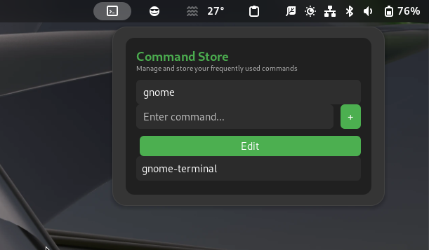
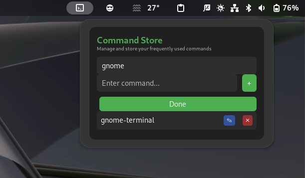

# Command Store GNOME Extension

## Overview
Command Store is a powerful GNOME extension that helps users save, manage, and quickly access their most frequently used terminal commands.


## Features
- Save custom commands
- Categorize commands
- Quick search and retrieval
- Lightweight and user-friendly interface

## Installation

### From GNOME Extensions Website
1. Visit [https://extensions.gnome.org/extension/7591/commands-store](https://extensions.gnome.org)  
2. Search for "Command Store"
3. Toggle the switch to install the extension

#### Install from extensions.gnome.org (Recommended)

[](https://extensions.gnome.org/extension/7591/commands-store/)

### Manual Installation
```bash
git clone https://github.com/Sanjai-Shaarugesh/Commands-Store
cd command-store 
make installhttps://github.com/Sanjai-Shaarugesh/Commands-Store/
```

## Usage
1. Open the extension from GNOME Extensions menu
2. Click "Add New Command"
3. Enter command name and actual command
4. Use quick search to retrieve commands

## Screenshots





## Requirements
- GNOME Shell 45+
- Linux distribution with GNOME desktop

## Contributing
Contributions are welcome! Please read our [CONTRIBUTING.md](CONTRIBUTING.md) for details on our code of conduct and the process for submitting pull requests.

## License
This project is licensed under the MIT License - see the [LICENSE.md](LICENSE.md) file for details

## Support
If you encounter any issues or have suggestions, please [open an issue](https://github.com/Sanjai-Shaarugesh/Commands-Store/issues) on GitHub.

[](https://github.com/Sanjai-Shaarugesh/Commands-Store)


## Acknowledgments
- GNOME Extensions community
- All contributors and users

## Changelog
- v1.0.0: Initial release
- v1.1.0: Added command categories# Commands-Store
